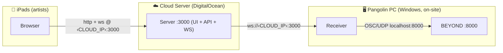
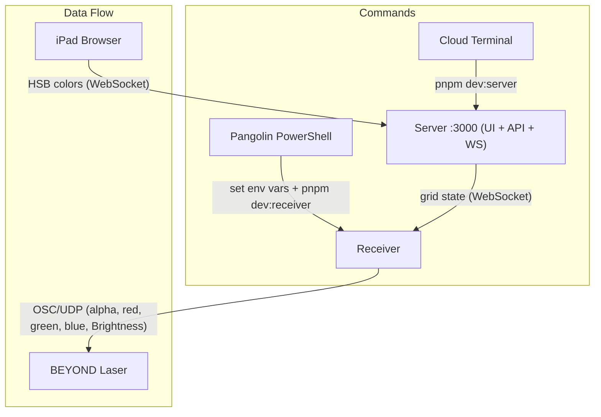

# Event Deployment Guide

## Architecture



**Three devices, three roles:**

| Device | Role | Talks to |
|--------|------|----------|
| **Cloud server** | Runs Server (UI + API + WebSocket, one port) | Serves iPads, feeds Receiver |
| **iPads** | Artist interface (browser) | Connects to the Cloud server |
| **Pangolin PC** | Runs Receiver → BEYOND | Pulls from Cloud, sends OSC locally |

---

## Step-by-step

### 1. Cloud Server (Linux)

The server serves the UI + API + WebSocket on one port, so a single process is all you need:

```sh
# Server — grid state engine + UI + API + WebSocket
pnpm dev:server
```

Open **http://‹CLOUD_IP›:3000** in the browser (the browser derives its WebSocket URL from the page origin — nothing to configure). Ensure port **3000** is open in the firewall.

### 2. Pangolin PC (Windows PowerShell)

#### Single BEYOND target

```powershell
$env:SIMULATOR_URL = "ws://<CLOUD_IP>:3000"
$env:BEYOND_HOST = "127.0.0.1"
$env:BEYOND_PORT = "8000"
$env:SHARD_START = "0"
$env:SHARD_END = "23"
$env:DEBUG_OSC = "1"
pnpm dev:receiver
```

#### Two BEYOND targets (split across two machines)

Use a routing config instead of `BEYOND_HOST`. Save `routing.json` in the repo root (see [examples/routing-two-beyond.json](../examples/routing-two-beyond.json) for a full 49-cannon version):

```json
{
  "targets": {
    "beyond-a": { "type": "beyond", "host": "<BEYOND_A_IP>", "port": 8000 },
    "beyond-b": { "type": "beyond", "host": "<BEYOND_B_IP>", "port": 8000 }
  },
  "flushHz": 30,
  "cannons": [
    { "logical": 0,  "target": "beyond-a", "projectorIndex": 0  },
    { "logical": 1,  "target": "beyond-a", "projectorIndex": 1  },
    { "logical": 2,  "target": "beyond-a", "projectorIndex": 2  },
    ...
    { "logical": 24, "target": "beyond-b", "projectorIndex": 0  },
    { "logical": 25, "target": "beyond-b", "projectorIndex": 1  },
    ...
    { "logical": 48, "target": "beyond-b", "projectorIndex": 24 }
  ]
}
```

Then run:

```powershell
$env:ROUTING_CONFIG = "routing.json"
$env:SIMULATOR_URL = "ws://<CLOUD_IP>:3000"
$env:DEBUG_OSC = "1"
pnpm dev:receiver
```

> Do **not** set `BEYOND_HOST` when using `ROUTING_CONFIG` — they are mutually exclusive.

### 3. iPads

Open Safari and navigate to:

```
http://<CLOUD_IP>:3000
```

---

## Placeholders

Replace these before running:

| Placeholder | Example | Description |
|-------------|---------|-------------|
| `<CLOUD_IP>` | `203.0.113.50` | Public IP of the DigitalOcean droplet |
| `<BEYOND_A_IP>` | `192.168.1.68` | LAN IP of first BEYOND PC |
| `<BEYOND_B_IP>` | `192.168.1.69` | LAN IP of second BEYOND PC |

---

## Quick Reference



## Troubleshooting

Advanced → OSC in the desktop app is the fastest first look: it shows the
resolved target and port, probes it, reads BEYOND.ini where BEYOND is installed
locally, sends blackout / full white / full amber (one zone or all) and tails
every message in and out.

| Symptom | Fix |
|---------|-----|
| UI loads but painting does nothing | The browser's WebSocket is same-origin — make sure you opened the UI at the server's real host:port (not localhost) and port 3000 is reachable |
| Receiver connects but no laser response | Verify BEYOND's OSC server is on port 8000, and "Show R-G-B-A panel" is enabled in BEYOND settings |
| Colors wrong in `rgb` mode | Confirm `alpha` is being sent (check `DEBUG_OSC=1` output for `/livecontrol/alpha 255`) |
| Receiver can't connect to server | Check cloud firewall allows inbound on port 3000 |
| White shows as red | Ensure BEYOND's RGBA panel is enabled: Settings → Configuration → Live Control → Extra Controls → "Show R-G-B-A panel" |
